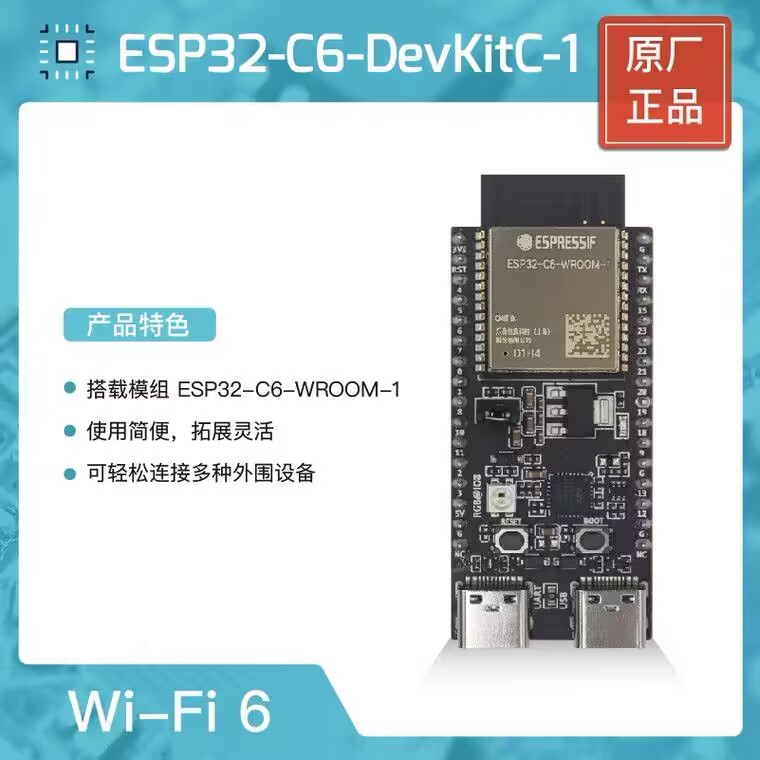

# 智慧农业

智慧农业-生态温室大棚监控系统

## 产品介绍

本产品是一个环境采集装置，包含了一系列的传感器用于检测环境状态信息，并可以将传感器信息上报给后台进行分析。主要包含以下四大功能。

__环境监控__，在线实时24小时连续的采集和记录监测点位的温度、湿度、光照、土壤温度、土壤湿度、可燃气体浓度等环境各项参数情况，与无线通信网络实现农业生产环境的智能感知、智能预警、智能决策及处理等。

__远程控制__，根据现场条件开启关闭设备，控制温室湿帘风机、喷淋滴灌、内外遮阳、顶窗侧窗、加温补光等设备。

__智慧安防__，红外线感应监控棚区生物，智能开启防盗警报；监控棚区可燃气体的浓度，智能开启消防警报与通风。

__数字孪生__，以数字、图形和图像等多种方式进行实时显示和记录存储监测信息，以三维可视化的方式展示数据。

## 技术优势

智慧农业是一种以互联网、移动互联网、云计算、物联网为一体的先进农业生产方式。（环境温湿度、土壤水分、二氧化碳、图像等）和无线通信网络实现农业生产环境的智能感知、智能预警、智能决策、智能分析、专家在线指导，为农业生产提供精准化种植、可视化管理、智能化决策。

“智慧农业”是将云计算、传感网、3S等各种信息技术集成到农业中，为农业提供更加完善的信息化支持、更透彻的农业信息感知、更集中的数据资源、更广泛的互联互通、更深入的智能控制、更贴心的公众服务。“智慧农业”与现代生物技术、种植技术等科学技术融合于一体，对建设世界水平农业具有重要意义。

### 硬件方案

芯片方案：（二选一）

1. 华为海思Hi3861芯片
2. 乐鑫ESP32系列芯片

Hi3861 开发更具有挑战性。芯片自主可控，采用开源 RISC-V 架构。拥抱 Openharmony 生态。  
ESP32 系列芯片价格低廉，性能够用，开发简单，开源库丰富。同时支持wifi和蓝牙。

#### 华为海思Hi3861介绍

华为海思 Hi3861 芯片，它包括一个主频为 160MHz 的 32 位 RISC-V 内核、352KB SRAM 和 288KB ROM。  
该模块还集成了 2MB 闪存和集成 Wi-Fi 控制器，支持 IEEE 802.11b/g/n，在 2.4GHz 频谱上的最大数据速率为 72.2Mbps。  
集成到 SoC 中的外设包括 SDIO、SPI、I2C、GPIO、UART、ADC、PWM 和 I2S。

芯片将运行基于华为开源的 LiteOS 内核的 Open Harmony 轻量系统（mini system）系统。  
支持 Open Harmony 3.0 LTS 或 3.1 beta 版本。  

#### 乐鑫ESP32系列芯片介绍

ESP32是一系列低成本，低功耗的单片机微控制器，集成了Wi-Fi和双模蓝牙。 ESP32系列采用Tensilica Xtensa LX6微处理器，包括双核心和单核变体，内置天线开关，RF变换器，功率放大器，低噪声接收放大器，滤波器和电源管理模块。  

ESP32-C6-DevKitC-1 是一款通用型模组，支持 Wi-Fi 6 、蓝牙5.0及IEEE 802.15.4 (Zigbee 3.0 和 Thread)。该款模组内置 ESP32-C6 芯片，并配置8MB SPI flash。同时外设接口丰富，支持 I2C, SPI, CAN 等。  

ESP32有云端一体的全链路开发框架，支持 Arduino framework 开发。

#### 传感器及外部设备

传感器需要做到实时检测大棚内环境温度湿度和光照强度，可以实现远程开启补光灯及通风电机等，实现控制大棚内的环境。

包括的传感器：

- 温湿度传感器 DHT11
- 光敏传感器
- 气体传感器（包括二氧化碳和可燃气体）
- 土壤湿度传感器
- 红外线人体感应器
- 水泵
- 风扇
- 灯泡

### 设备与云端进行通信

设备与IoT云间的通讯协议包含了MQTT，LwM2M/CoAP，HTTP/HTTP2，Modbus，OPC-UA，OPC-DA。而我们设备端与云端通讯主要用的协议是MQTT。

单节点设备通过WiFi接入互联网。并通过MQTT协议与服务器进行通信。
<!-- 
> 多节点模式下，一种可能的方案：  
使用更加低廉的单片机进行传感器的数据获取和转动风扇等低级命令的执行，设备间协商一套内部协议，并通过 LoRA/RS232/RS485/Bluetooth 等方式进行组网，最后使用一个统一的网关进行数据收集和外部互联网的通信 -->

### 数字孪生开发平台

物联网三维可视化开发平台,拥有自主研发数字孪生技术,使用者可借助平台开发：智慧城市、智慧社区、智慧校园、智慧园区、智慧农业、能源管理等多种行业解决方案。

...此处需要配图

### 技术要求

- 熟悉 C/C++ 大型项目开发流程，熟悉传感器外设通信协议和驱动的实现。同时掌握 Linux 开发环境搭建和开源工具链的使用
- 熟悉硬件开发流程，拥有原理图绘制，PCB layout，成本控制，硬件测试等开发经验
- 掌握Java程序设计语言，拥有Java EE企业级应用开发经验
- 掌握前端开发的HTML5、CSS3、JavaScript ES6等基础语言
- 掌握企业应用开发，按照企业前后分离进行协作开发，熟悉常用通信协议
- 掌握服务器容器技术，并应用在项目部署中
- 掌握业务流程、业务功能开发相关技术，按企业标准进行核心模块开发

## 应用场景

中国是一个农业大国，但不是一个农业强国。目前我国果园的高产主要依靠农药和化肥的大量投入。我国的农业生产大多依靠人工经验进行管理，缺乏系统的科学指导。设施智慧栽培在解决我国城乡居民消费结构和增加农民收入方面发挥了重要作用。

产品主要应用场景是智能化温室。用户可以随时通过个人计算机和智能手机，随时了解大棚、温室、仓库等生产环境的情况，并进行远程控制。通过应用软件，使用者可以实时、准确地获得类似农业生产环境的各种环境指标，如大棚/温室/仓库等，并将各项监测指标具体化，达到心中有数。另外，当监控指标异常时，可由人工或自动化的环境调节装置进行遥控，不仅能达到精确、自动的操作，而且能使农业生产环境始终处于最佳状态。此外，还能增加农业的劳动生产率，减少农作物对外界环境的依赖性。农产品质量和安全问题是当前我国人民群众最为关注的问题。
